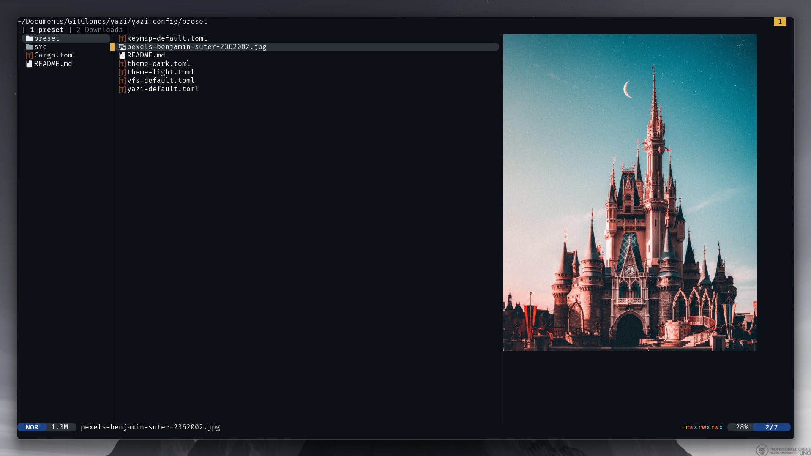

<div align="center">
  
</div>

<h3 align="center">
  Example Flavor for <a href="https://github.com/sxyazi/yazi">Yazi</a>
</h3>

## 👀 Preview



## 🎨 Installation

```sh
ya pkg add alastairsounds/github-dark-default
```

## ⚙️ Usage

To set it as your dark flavor, change the content of your `theme.toml` to:

```toml
[flavor]
dark = "github-dark-default"
```

Make sure your `theme.toml` doesn't contain anything other than `[flavor]`, unless you want to override certain styles of this flavor.

See the [Yazi flavor documentation](https://yazi-rs.github.io/docs/flavors/overview) for more details.

## 📜 License

The flavor is MIT-licensed, and the included tmTheme is also MIT-licensed.

Check the [LICENSE](LICENSE) and [LICENSE-tmtheme](LICENSE-tmtheme) file for more details.

**Note on Theme Source**: The `flavor.toml` file (GitHub Dark Default) is derived from the [GitHub VS Code theme](https://github.com/primer/github-vscode-theme) to ensure consistency with the original design.
